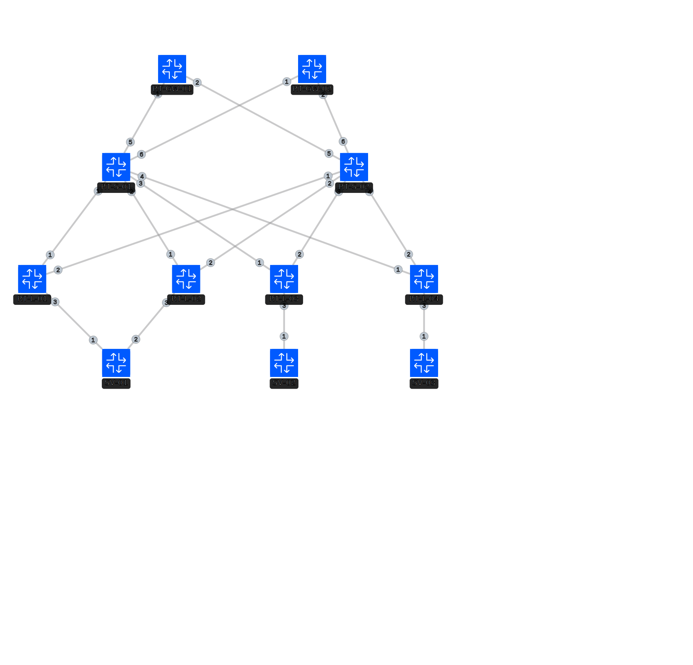

# EVPN-VXLAN with Centralized Anycast Gateway (All-Active)

このプロジェクトは、Arista cEOS と FRR (Linux) を組み合わせた EVPN-VXLAN ファブリックの検証環境です。
特に、**集中型エニーキャストゲートウェイ (Centralized Anycast Gateway)** を 2 台のノードで **All-Active** に構成し、冗長性と負荷分散（ECMP）を両立させています。

## ネットワーク構成図


## ネットワークパラメータ

### コントロールプレーン / アンダーレイ
| カテゴリ | ノード名 | AS番号 | Loopback0 (RID) | Anycast VTEP | 役割 / 備考 |
| :--- | :--- | :--- | :--- | :--- | :--- |
| **Spine** | RT-S-01 | 65110 | 10.1.254.11 | - | BGP EVPN RR / Underlay Hub |
| **Spine** | RT-S-02 | 65110 | 10.1.254.12 | - | BGP EVPN RR / Underlay Hub |
| **Leaf** | RT-L-01 | 65121 | 10.1.254.21 | - | ESI Multihoming (ESI: ...0809) |
| **Leaf** | RT-L-02 | 65122 | 10.1.254.22 | - | ESI Multihoming (ESI: ...0809) |
| **Leaf** | RT-L-03 | 65123 | 10.1.254.23 | - | FRR Node (VNI 1010) |
| **Leaf** | RT-L-04 | 65124 | 10.1.254.24 | - | FRR Node (VNI 1020) |
| **Gateway** | RT-GW-01 | 65130 | 10.1.254.31 | 10.1.254.30 | Centralized Anycast GW (All-Active) |
| **Gateway** | RT-GW-02 | 65130 | 10.1.254.32 | 10.1.254.30 | Centralized Anycast GW (All-Active) |

### データプレーン (Anycast GW & Servers)
| ノード名 | インターフェース | IPアドレス | MACアドレス | 備考 |
| :--- | :--- | :--- | :--- | :--- |
| **Anycast GW** | Vlan 10/20 | .254 | aa:bb:cc:00:02:54 | Virtual IP/MAC |
| **SV-01** | bond0 | 192.168.10.1/24 | aa:bb:cc:10:11:01 | VLAN 10 (Access) |
| **SV-02** | eth1.10 | 192.168.10.10/24 | aa:bb:cc:10:11:10 | VLAN 10 (Tagged) |
| **SV-03** | eth1.20 | 192.168.20.1/24 | aa:bb:cc:10:22:01 | VLAN 20 (Tagged) |

## 主要な技術的特徴

### 1. Anycast VTEP (Shared VTEP IP)
集中型ゲートウェイを 2 台構成にすると、通常の個別 VTEP では BUM トラフィック（ARP 等）が両方のゲートウェイに届き、パケットの重複（Duplicate/DUP!）が発生します。
本環境では、**Anycast VTEP** 方式を採用することでこれを解決しています。
- **共有 IP**: `10.1.254.30/32` を RT-GW-01 と RT-GW-02 の `Loopback1` に設定。
- **動作原理**: Leaf からゲートウェイへの通信は論理的に 1 つの VTEP IP 宛てとなり、Spine における ECMP によって物理的にどちらか一方のゲートウェイにのみパケットが届きます。これにより、応答の重複を完全に排除しつつ All-Active な冗長性を実現しています。

### 2. Port-Channel (LACP) over Multi-Chassis
Gateway と Spine の間は Port-Channel (LACP) で接続されています。
- Spine 側で GW-01 用と GW-02 用に個別の Port-Channel ID を割り当てることで、対向機器の誤認を防止しています。

### 3. FRR/Linux EVPN Bridge 構成
Linux ノード (`RT-L-03, 04`) では、`vlan_filtering 1` 有効のブリッジを使用しています。
- VNI デバイスと物理サブインターフェースを適切な VLAN ID にマッピングし、Zebra (FRR) がカーネルの FDB/Flood List を正しく制御できるように構成されています。

## 検証済みシナリオ
- [x] 同一 VNI 内の L2 疎通 (SV-01 <-> SV-02)
- [x] 集中型ゲートウェイ経由の Inter-VLAN ルーティング (SV-01 <-> SV-03)
- [x] ゲートウェイ冗長化におけるパケット重複の解消 (Anycast VTEP)
- [x] BGP Unnumbered によるアンダーレイの自動構成

## 使い方
1. Containerlab でデプロイ:
   ```bash
   sudo clab deploy -t EVPNVXLAN-Multihoming.clab.yml
   ```
2. 疎通確認 (SV-01 から Gateway への Ping):
   ```bash
   docker exec SV-01 ping 192.168.10.254
   ```
3. 疎通確認 (Inter-VLAN):
   ```bash
   docker exec SV-01 ping 192.168.20.1
   ```
