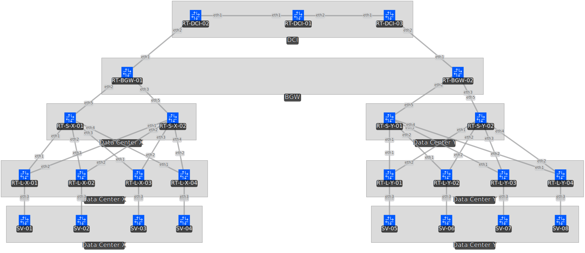

# EVPN/VXLAN
EVPN/VXLANの学習のために一足いや5足ぐらい飛んでいるが「Multi Site」構成で組んでみた

EVPNとかVXLANのことについてはZennでまとめるつもり

## 構成

- DCI Router 3台
  - DCI-01
  - DCI-02
  - DCI-03

- Data Center
  - Border GW Router 1台
  - Spine 2台
  - Leaf 4台
  - Host 4台

以上のような構成で行う。Data Centerは X Site と Y Site を用意し、それぞれわかるように命名をしている。

# EVPN/VXLAN トポロジ情報

本構成は、マルチサイト対応のEVPN/VXLANネットワークであり、各Leafに一意のASNを割り当て、Route Server経由でEVPNルートを交換します。BGWにはVTEPが設定され、VXLANトンネルを通じてサイト間L2/L3通信を可能にしています。

---

## Site-X 構成

| デバイス名  | 役割      | IPアドレス                         | Loopback IP      | ASN    | 備考  |
|-----------|-----------|----------------------------------|------------------|--------|------|
| BGW-01    | BGW/VTEP  | eth1: 10.1.254.1                 | lo: 10.1.254.1   | 65100  |      |
|           |           | eth2-3: ipv6 link-local-address  |                  |        |      |
| Spine-11  | Spine     | eth1-5: ipv6 link-local-address  | lo: 10.1.254.11  | 65110  |      |
| Spine-12  | Spine     | eth1-5: ipv6 link-local-address  | lo: 10.1.254.12  | 65110  |      |
| Leaf-11   | Leaf      | eth1-2: ipv6 link-local-address  | lo: 10.1.254.21  | 65121  |      |
|           |           | eth3: 192.168.10.251             |                  |        |      |
| Leaf-12   | Leaf      | eth1-2: ipv6 link-local-address  | lo: 10.1.254.22  | 65122  |      |
|           |           | eth3: 192.168.10.252             |                  |        |      |
| Leaf-13   | Leaf      | eth1-2: ipv6 link-local-address  | lo: 10.1.254.23  | 65123  |      |
|           |           | eth3: 192.168.20.251             |                  |        |      |
| Leaf-14   | Leaf      | eth1-2: ipv6 link-local-address  | lo: 10.1.254.24  | 65124  |      |
|           |           | eth3: 192.168.20.252             |                  |        |      |
| SV-01     | Host      | eth1: 192.168.10.241             | lo: 10.1.254.31  | 65131  |      |
| SV-02     | Host      | eth1: 192.168.10.242             | lo: 10.1.254.32  | 65132  |      |
| SV-03     | Host      | eth1: 192.168.20.241             | lo: 10.1.254.33  | 65133  |      |
| SV-04     | Host      | eth1: 192.168.20.241             | lo: 10.1.254.34  | 65134  |      |

---

## Site-Y 構成

| デバイス名  | 役割      | IPアドレス                         | Loopback IP      | ASN    | 備考  |
|-----------|-----------|----------------------------------|------------------|--------|------|
| BGW-02    | BGW/VTEP  | eth1: 10.2.254.1                 | lo: 10.2.254.1   | 65200  |      |
|           |           | eth2-3: ipv6 link-local-address  |                  |        |      |
| Spine-21  | Spine     | eth1-5: ipv6 link-local-address  | lo: 10.2.254.11  | 65210  |      |
| Spine-22  | Spine     | eth1-5: ipv6 link-local-address  | lo: 10.2.254.12  | 65210  |      |
| Leaf-21   | Leaf      | eth1-2: ipv6 link-local-address  | lo: 10.2.254.21  | 65221  |      |
|           |           | eth3: 192.168.10.253             |                  |        |      |
| Leaf-22   | Leaf      | eth1-2: ipv6 link-local-address  | lo: 10.2.254.22  | 65222  |      |
|           |           | eth3: 192.168.10.254             |                  |        |      |
| Leaf-23   | Leaf      | eth1-2: ipv6 link-local-address  | lo: 10.2.254.23  | 65223  |      |
|           |           | eth3: 192.168.20.253             |                  |        |      |
| Leaf-24   | Leaf      | eth1-2: ipv6 link-local-address  | lo: 10.2.254.24  | 65224  |      |
|           |           | eth3: 192.168.20.254             |                  |        |      |
| SV-05     | Host      | eth1: 192.168.10.243             | lo: 10.2.254.31  | 65231  |      |
| SV-06     | Host      | eth1: 192.168.10.244             | lo: 10.2.254.32  | 65232  |      |
| SV-07     | Host      | eth1: 192.168.20.243             | lo: 10.2.254.33  | 65233  |      |
| SV-08     | Host      | eth1: 192.168.20.244             | lo: 10.2.254.34  | 65234  |      |

---

## 備考

- **Spineは同一ASNで構成され、Leaf–Spine間は eBGP**。
- **BGWとLeaf、BGWとRS間ではMP-BGP EVPNセッションを確立**。
- **Route TargetやVNIは別資料（またはFRR conf）に記載**。

## Todo
- [ ] READMEに随時情報をアップデートすること
- [ ] BGW同士で通信ができるようにする next-hop selfをつけてibgpで広報する
- [ ] leafのvrfで分けたからそこのBGPとかを考えないと
- [ ] もう少し細かく設計を考える。hostのmacアドレスはleafからEVPNでBGWに伝搬されるよね????てかVTEPってなんだよVXLAN Tunnelの始点と終点らしいけど
- [ ] EVPN, VXLANについて勉強したことをZennにまとめる  Multi Site, Multi Pod, Multi Fabricの違いってなんぞや
- [ ] FRR or SONiCにevpn multisite border-gateway <SITE-ID> と evpn multisite fabric-tracking   evpn multisite dci-tracking  があるのか見つけないと

We'll need at least two loopbacks to get the NVE working. Loopback0 will be acting as a source interface for the VXLAN tunnel and loopback100 is used for VIP purposes in case we have more than one BGW within one site. Essentially, the VIP address will be our next-hop for EVPN routes whereas loopback0 will be used for BUM traffic and a source of data plane traffic.

NVEを動作させるには、少なくとも2つのループバックが必要だ。loopback0はVXLANトンネルのソースインターフェースとして動作し、loopback100は1つのサイト内に複数のBGWがある場合のVIP用として使用されます。基本的に、VIPアドレスはEVPNルートのネクストホップとなり、loopback0はBUMトラフィックとデータプレーントラフィックのソースとして使用されます。