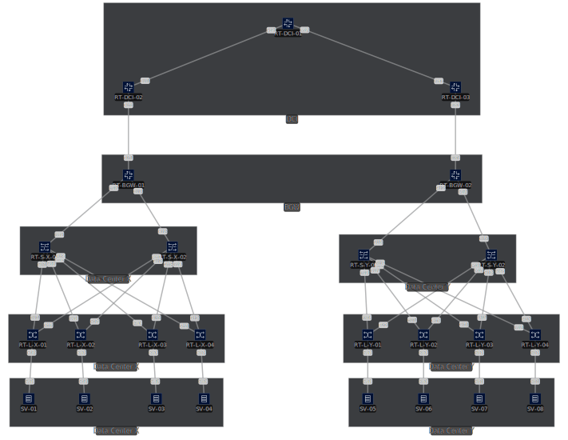

# EVPN/VXLAN
EVPN/VXLANの学習のために一足いや5足ぐらい飛んでいるが「Multi Site・Multi Tenant」構成で組んでみた

Zennの記事
[EVPN/VXLAN -座学編-](https://zenn.dev/nagayon/articles/jicjdsifjie324jifso "EVPN/VXLAN -座学編-")  
[EVPN/VXLAN -実践編-](https://zenn.dev/nagayon/articles/09379fdsahieojl3 "EVPN/VXLAN -実践編-")

## 構成

- DCI Router 3台
  - DCI-01
  - DCI-02
  - DCI-03

- Data Center
  - Border GW Router 1台
  - Spine 2台
  - Leaf 4台
  - Host 4台

以上のような構成で行う。Data Centerは X Site と Y Site を用意し、それぞれわかるように命名をしている。

## 技術スタック・ネットワーク構成詳細

本ラボ構成では、以下の技術およびアーキテクチャを採用しています。

### インフラストラクチャ
- **プラットフォーム**: [containerlab](https://containerlab.dev/)
- **ネットワークOS**: [FRR (Free Range Routing)](https://frrouting.org/) v10.5.1

### ネットワーク構成 (Underlay / Overlay)
- **物理トポロジ**: 各サイト内は 3-stage Clos (Spine-Leaf) 構成。
- **Underlay**: 
  - **BGP Unnumbered**: IPv6 Link-Localアドレスを利用したEBGPピアリング (RFC 5549)。
  - **ECMP**: Spine-Leaf間のマルチパス通信による負荷分散。
- **Control Plane (Overlay)**: 
  - **BGP EVPN**: Type-2 (MAC/IP), Type-3 (IMET), Type-5 (IP Prefix) ルートの広告。
  - **Multi-AS**: 各LeafおよびBGWに個別のAS番号を割り当てたEBGP構成。
- **Data Plane (Overlay)**: 
  - **VXLAN**: VTEP間でのカプセル化（標準UDP 4789ポート）。

### マルチテナント・マルチサイト
- **L3 Multi-Tenancy**: 
  - **VRF**: テナント分離のための仮想ルーティング（VRF `l3vni-3000`）。
  - **Symmetric IRB**: L3VNI (VNI 3000) を使用したサイト内・サイト間のルーティング。
- **L2 Extension**: 
  - **L2VNI**: 同一セグメントをサイト間で延伸（VNI 1010, 1020）。
- **Anycast Gateway**: 各Leafで共通のIP/MACアドレスを保持し、ホストのデフォルトゲートウェイとして機能。
- **Multi-Site (DCI)**: 
  - **Border Gateway (BGW)**: サイト間のEVPNルート交換およびVXLANトラフィックの終端・転送を担当。
  - **DCI (Data Center Interconnect)**: BGW間を中継する外部ネットワーク。

# EVPN/VXLAN トポロジ情報

本構成は、マルチサイト対応のEVPN/VXLANネットワークであり、各Leafに一意のASNを割り当て、Route Server経由でEVPNルートを交換します。BGWにはVTEPが設定され、VXLANトンネルを通じてサイト間L2/L3通信を可能にしています。

---

## Site-X 構成

| デバイス名  | 役割      | MACアドレス                  | IPアドレス                        | Loopback IP      | ASN    | 備考  |
|-----------|-----------|----------------------------|----------------------------------|------------------|--------|------|
| RT-BGW-01 | BGW       | auto                       | eth1: 172.16.93.10               | lo: 10.1.254.1   | 65100  |      |
|           |           | auto                       | eth2-3: ipv6 link-local-address  |                  |        |      |
| RT-S-X-01 | Spine     | auto                       | eth1-5: ipv6 link-local-address  | lo: 10.1.254.11  | 65110  |      |
| RT-S-X-02 | Spine     | auto                       | eth1-5: ipv6 link-local-address  | lo: 10.1.254.12  | 65110  |      |
| RT-L-X-01 | Leaf      | VNI3000: aa:bb:cc:10:30:21 | eth1-2: ipv6 link-local-address  | lo: 10.1.254.21  | 65121  |      |
|           |           | VNI1010: aa:bb:cc:10:11:21 | eth3: 192.168.10.254             |                  |        |      |
| RT-L-X-02 | Leaf      | VNI3000: aa:bb:cc:10:30:22 | eth1-2: ipv6 link-local-address  | lo: 10.1.254.22  | 65122  |      |
|           |           | VNI1010: aa:bb:cc:10:11:22 | eth3: 192.168.10.254             |                  |        |      |
| RT-L-X-03 | Leaf      | VNI3000: aa:bb:cc:10:30:23 | eth1-2: ipv6 link-local-address  | lo: 10.1.254.23  | 65123  |      |
|           |           | VNI1020: aa:bb:cc:10:12:23 | eth3: 192.168.20.254             |                  |        |      |
| RT-L-X-04 | Leaf      | VNI3000: aa:bb:cc:10:30:24 | eth1-2: ipv6 link-local-address  | lo: 10.1.254.24  | 65124  |      |
|           |           | VNI1020: aa:bb:cc:10:12:24 | eth3: 192.168.20.254             |                  |        |      |
| SV-01     | Host      | aa:bb:cc:10:11:31          | eth1: 192.168.10.241             | lo: 10.1.254.31  | 65131  |      |
| SV-02     | Host      | aa:bb:cc:10:11:32          | eth1: 192.168.10.242             | lo: 10.1.254.32  | 65132  |      |
| SV-03     | Host      | aa:bb:cc:10:22:33          | eth1: 192.168.20.241             | lo: 10.1.254.33  | 65133  |      |
| SV-04     | Host      | aa:bb:cc:10:22:34          | eth1: 192.168.20.242             | lo: 10.1.254.34  | 65134  |      |

---

## Site-Y 構成

| デバイス名  | 役割      | MACアドレス                  | IPアドレス                        | Loopback IP      | ASN    | 備考  |
|-----------|-----------|----------------------------|----------------------------------|------------------|--------|------|
| RT-BGW-02 | BGW       | auto                       | eth1: 172.16.93.14               | lo: 10.2.254.1   | 65200  |      |
|           |           | auto                       | eth2-3: ipv6 link-local-address  |                  |        |      |
| RT-S-Y-01 | Spine     | auto                       | eth1-5: ipv6 link-local-address  | lo: 10.2.254.11  | 65210  |      |
| RT-S-Y-02 | Spine     | auto                       | eth1-5: ipv6 link-local-address  | lo: 10.2.254.12  | 65210  |      |
| RT-L-Y-01 | Leaf      | VNI3000: aa:bb:cc:20:30:21 | eth1-2: ipv6 link-local-address  | lo: 10.2.254.21  | 65221  |      |
|           |           | VNI1010: aa:bb:cc:20:11:21 | eth3: 192.168.10.254             |                  |        |      |
| RT-L-Y-02 | Leaf      | VNI3000: aa:bb:cc:20:30:22 | eth1-2: ipv6 link-local-address  | lo: 10.2.254.22  | 65222  |      |
|           |           | VNI1010: aa:bb:cc:20:11:22 | eth3: 192.168.10.254             |                  |        |      |
| RT-L-Y-03 | Leaf      | VNI3000: aa:bb:cc:20:30:23 | eth1-2: ipv6 link-local-address  | lo: 10.2.254.23  | 65223  |      |
|           |           | VNI1020: aa:bb:cc:20:12:23 | eth3: 192.168.20.254             |                  |        |      |
| RT-L-Y-04 | Leaf      | VNI3000: aa:bb:cc:20:30:24 | eth1-2: ipv6 link-local-address  | lo: 10.2.254.24  | 65224  |      |
|           |           | VNI1020: aa:bb:cc:20:12:24 | eth3: 192.168.20.254             |                  |        |      |
| SV-05     | Host      | aa:bb:cc:20:11:35          | eth1: 192.168.10.243             | lo: 10.2.254.31  | 65231  |      |
| SV-06     | Host      | aa:bb:cc:20:11:36          | eth1: 192.168.10.244             | lo: 10.2.254.32  | 65232  |      |
| SV-07     | Host      | aa:bb:cc:20:22:37          | eth1: 192.168.20.243             | lo: 10.2.254.33  | 65233  |      |
| SV-08     | Host      | aa:bb:cc:20:22:38          | eth1: 192.168.20.244             | lo: 10.2.254.34  | 65234  |      |

---
