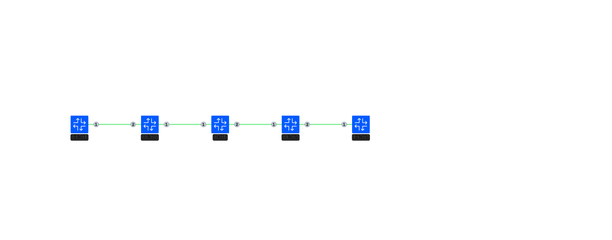

# Cisco SRv6 L2VPN (E-LINE/VPWS)

Cisco XRD を使用した SRv6 L2VPN (EVPN-VPWS) の検証用環境です。

## 構成

- PE: Cisco XRD (RT-01, RT-02, RT-03)
- CE: Cisco XRD (RT-CE-01, RT-CE-02)

## トポロジー図



`spec.clab.yml` に記載されている通り、複数のPEノードを介してCE間をL2で接続します。

## 使用されているSRv6機能

- **SRv6 uSID (NEXT-C-SID)**: `format usid-f3216` を使用。
- **Locator**: `micro-segment behavior unode psp-usd` (uSIDにおける End 機能に相当)。
- **Service**: EVPN-VPWS (E-LINE) over SRv6。
- **Endpoint Behavior**: 
    - `End.DX2`: L2VPWS の終端に使用。

## 確認用コマンド集

デプロイ後に以下のコマンドで状態を確認できます。（※これらのコマンドはAIによって生成されたため、実際の挙動と異なる可能性があります。内容の正確性は保証されません）

```bash
# SRv6 Locator の状態確認
show segment-routing srv6 locators

# SID テーブルの確認 (End.DX2 など)
show segment-routing srv6 sid

# EVPN VPWS (Xconnect) の状態確認
show evpn xconnect

# BGP EVPN ルートの確認
show bgp l2vpn evpn

# インターフェースの状態確認
show l2vpn xconnect
```

## デプロイ

```bash
sudo containerlab deploy -t spec.clab.yml
```
