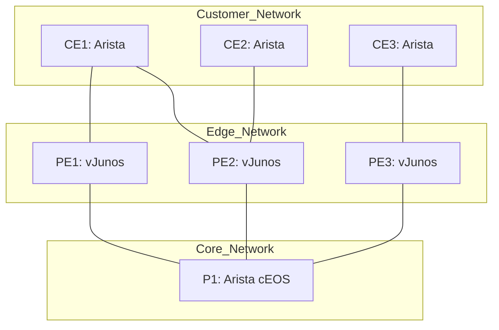

# Juniper SRv6 L2VPN (E-LAN/EVPN)

Juniper vJunos Router を使用した SRv6 L2VPN (EVPN-ELAN) の検証用環境です。

## 構成

- PE: Juniper vJunos (pe1, pe2, pe3)
- P: Arista cEOS (p1)
- CE: Arista cEOS (ce1, ce2, ce3)

## トポロジー図

PE 間の接続は SRv6 をベースに行われ、CE 間で L2 マルチポイント接続 (E-LAN) を実現します。



## 使用されているネットワーク機能

- **Core IGP**: ISIS (Level 2)
    - P1 (Arista) と PE1-3 (Juniper) 間で隣接関係を確立。
    - IPv6 Unicast Address Family を使用。
- **SRv6 uSID (NEXT-C-SID)**: `micro-sid` を有効化。
- **Locator Behavior**: 
    - `micro-node-sid`: End 機能に相当。
- **Service Behavior**: 
    - `micro-dt2-sid`: EVPN (MAC-VRF) の終端に使用 (`End.DT2U` / `End.DT2M` に相当)。
- **Service**: EVPN-ELAN over SRv6.

## SRv6 設定の解説

Juniper vJunos における SRv6 (Source Packet Routing) の主要な設定ポイントです。

1.  **Source Packet Routing (SRv6)**: `routing-options source-packet-routing srv6` にて Locator を定義します。`micro-sid` を指定することで uSID 機能を有効化しています。
2.  **ISIS との統合**: `protocols isis` 配下で `source-packet-routing srv6` を有効にし、Locator と `micro-node-sid` (End) を割り当てます。
3.  **EVPN (MAC-VRF) の SRv6 対応**: 各 `routing-instance` (elan200, elan201) において `protocols evpn encapsulation srv6` を指定し、サービス SID として `micro-dt2-sid` (End.DT2U/M) を Locator に紐付けます。
4.  **BGP EVPN シグナリング**: `protocols bgp` の `family evpn` 内で `advertise-srv6-service` および `accept-srv6-service` を設定し、BGP 経由で SRv6 サービス情報を交換できるようにします。

## 確認用コマンド集

デプロイ後に以下のコマンドで状態を確認できます。（※これらのコマンドはAIによって生成されたため、実際の挙動と異なる可能性があります。内容の正確性は保証されません）

```bash
# SRv6 Locator の状態確認
show route table srv6.0

# ISIS による SID (uSID) の学習状況確認
show isis source-packet-routing srv6 locator

# EVPN MAC テーブルの確認
show evpn mac-table

# BGP EVPN ピアの状態確認
show bgp summary

# SRv6 サービス情報の確認 (End.DT2U/M など)
show route table elan200.evpn.0
```

## デプロイ

```bash
sudo containerlab deploy -t spec.clab.yml
```

## トラブルシューティング (vJunos 起動に関して)

vJunos はリソース消費が激しく、完全に起動するまで 10〜15 分程度かかることがあります。

- **Health チェックが unhealthy のまま**: `docker logs <container_name>` で起動状況を確認してください。シリアルコンソールの `login:` プロンプトで停止している場合は、バックグラウンドでの初期設定に時間がかかっています。
- **リソース要件**: ノードあたり最低 5GiB のメモリと 2 コアを推奨します。ホストマシンのメモリ不足により OOM (Out Of Memory) が発生すると、インターフェースが上がらない、またはノードがクラッシュする原因となります。
- **KVM**: ホストで `/dev/kvm` が有効であることを確認してください。また、`spec.clab.yml` の `qemu-args: "-cpu host"` 設定により、ホストの CPU 機能をパススルーさせることで安定性が向上する場合があります。

