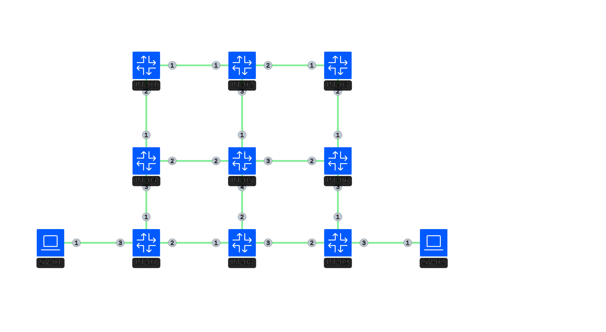

# SRv6-TE uSID L3VPN ラボ

このリポジトリは、Cisco XRd ノードを使用した **SRv6 (Segment Routing IPv6)**、**uSID (Micro-segments)**、**L3VPN**、および **Traffic Engineering (SR-TE)** をデモンストレーションするための containerlab ベースのネットワークラボ環境です。

## トポロジー概要



このラボは 9 台の Cisco XRd ルーターと 2 台の Linux ホスト (netshoot) で構成されています。

- **AS 番号**: 65100
- **IGP**: IS-IS (IPv6 Unicast)
- **BGP**: VPNv4 アドレスファミリーを使用した iBGP
- **SRv6 Locator**: `cafe:57:<node-id>::/48`
- **uSID フォーマット**: `f3216`
- **ルートリフレクタ (RR)**: RT-05 (5:5:5::5)

### ノード一覧

| ノード名 | 種類 | イメージ | 説明 |
|-----------|------|-------|-------------|
| RT-01 ～ RT-09 | cisco_xrd | `ghcr.io/nagayon-935/network-images/cisco_xrd:25.2.2-v1` | コア/PE ルーター |
| SV-01 | linux | `nicolaka/netshoot:latest` | カスタマーホスト A (100.100.100.1/24) |
| SV-02 | linux | `nicolaka/netshoot:latest` | カスタマーホスト B (200.200.200.1/24) |

### L3VPN の詳細

- **VRF 名**: `NETCON`
- **RD/RT**:
  - RT-07: RD `65100:107`, RT `65100:100` (Export), `65100:100/200` (Import)
  - RT-09: RD `65100:109`, RT `65100:200` (Export), `65100:100/200` (Import)
- **サービス**: SV-01 と SV-02 間の SRv6 を介したエンドツーエンド IPv4 通信。

### SRv6 Traffic Engineering (SR-TE)

RT-07 には、RT-09 (9:9:9::9) を宛先とする SR-TE ポリシー (`DRAW_J57_POLICY`) が設定されています。
このポリシーは明示的なセグメントリスト (`DRAW_J57_LIST`) を使用し、以下の順序でトポロジーを通過します。
`RT-08 -> RT-05 -> RT-04 -> RT-01 -> RT-02 -> RT-03 -> RT-06 -> RT-09`

### 使用されている SRv6 機能 (Behavior)

このトポロジーでは、以下の SRv6 Behavior が使用されています。

- **uNode (Micro-segment)**: 全てのノード (RT-01 ～ RT-09) で `uNode` behavior (`psp-usd`) が設定されています。これにより、IPv6 宛先アドレス内の短い (16-bit) SID を使用した効率的なパケット処理が可能になります。
- **End.DT4**: PE ルーター (RT-07 および RT-09) が L3VPN (IPv4) のために使用します。BGP の VRF 設定で `alloc mode per-vrf` として設定されており、カプセル化解除後に特定の VRF テーブルを参照します。
- **uB6-Insert-Reduced**: RT-07 の SR-TE ポリシーで Binding SID (BSID) として使用されています。パケットをポリシーに誘導する際、指定されたセグメントリストを含む SRH (Segment Routing Header) を挿入します。

## 必要要件

- [containerlab](https://containerlab.dev/)
- Docker または Finch
- Cisco XRd イメージ (`spec.clab.yml` に記載されているもの)

## 確認用コマンド一覧

> [!CAUTION]
> 以下のコマンド一覧は AI によって生成されたものです。実際の動作やバージョンによっては正しくない可能性があるため、必要に応じて公式ドキュメント等を参照してください。

ラボの各コンポーネントの状態を確認するための主要なコマンドです。

### 1. インフラストラクチャ (IGP/SRv6) の確認
ルーター間の到達性と SRv6 locator の配布状況を確認します。
```bash
# ISIS 隣接関係の確認
show isis neighbors

# ISIS IPv6 ルーティングテーブル (Locator 情報の確認)
show isis route ipv6

# SRv6 Locator と SID の確認
show segment-routing srv6 locator
show segment-routing srv6 sid
```

### 2. BGP および L3VPN の確認
VPN ルートの学習状況と SRv6 encapsulation の適用状況を確認します。
```bash
# BGP VPNv4 隣接関係の確認
show bgp vpnv4 unicast summary

# VRF 内のルーティングテーブル確認
show route vrf NETCON

# 特定の宛先への転送パスと SRv6  encapsulation の確認
show cef vrf NETCON 200.200.200.1
```

### 3. SR-TE ポリシーの確認
ポリシーのステータスと、トラフィックが明示的なパス（Segment List）を通るかを確認します。
```bash
# SR-TE ポリシーの詳細表示
show segment-routing traffic-eng policy name DRAW_J57_POLICY

# ポリシーの転送統計 (パケットカウント) の確認
show segment-routing traffic-eng policy name DRAW_J57_POLICY detail
```

### 4. ホスト間疎通確認
SV-01 から SV-02 への通信を確認します。
```bash
# SV-01 から SV-02 (200.200.200.1) への ping
docker exec -it clab-SRv6-TE_uSID_L3VPN-SV-01 ping 200.200.200.1

# 経路の確認 (traceroute)
docker exec -it clab-SRv6-TE_uSID_L3VPN-SV-01 traceroute 200.200.200.1
```

## 使用方法

### 1. ラボのデプロイ
```bash
sudo containerlab deploy -t spec.clab.yml
```

### 2. 削除
```bash
sudo containerlab destroy -t spec.clab.yml
```

